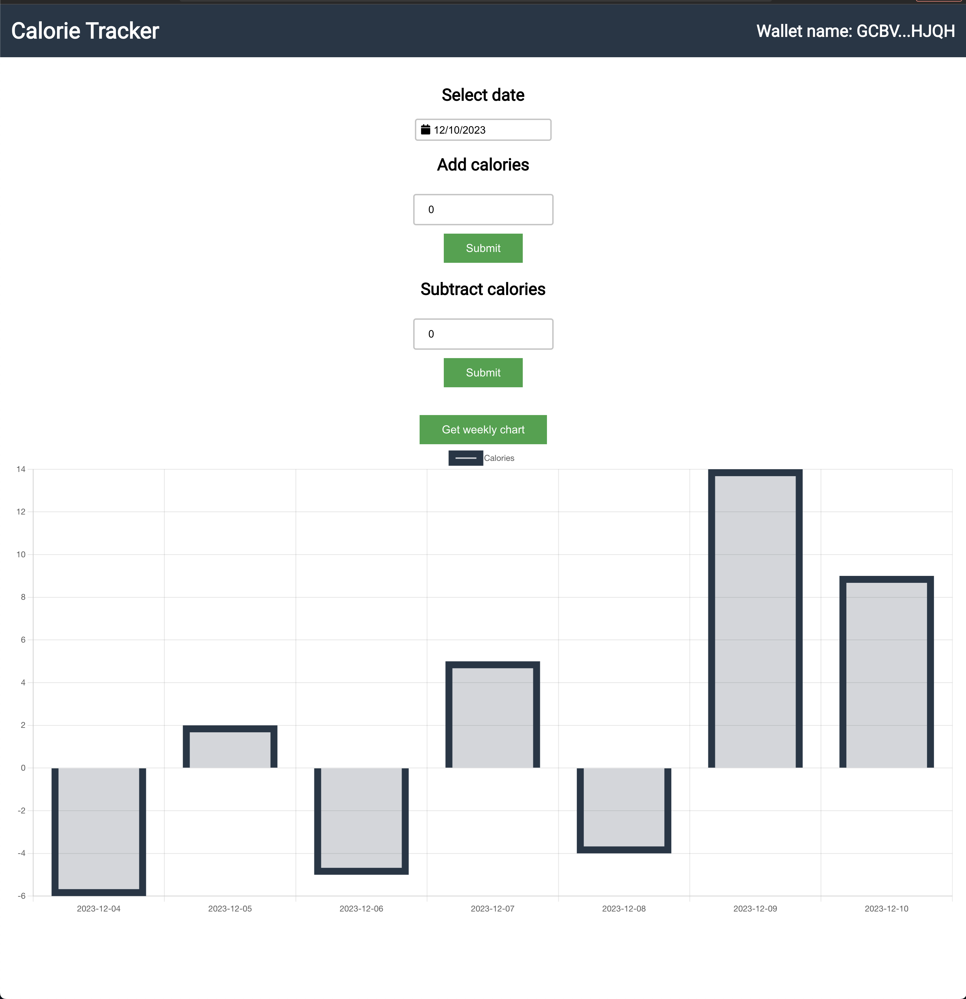
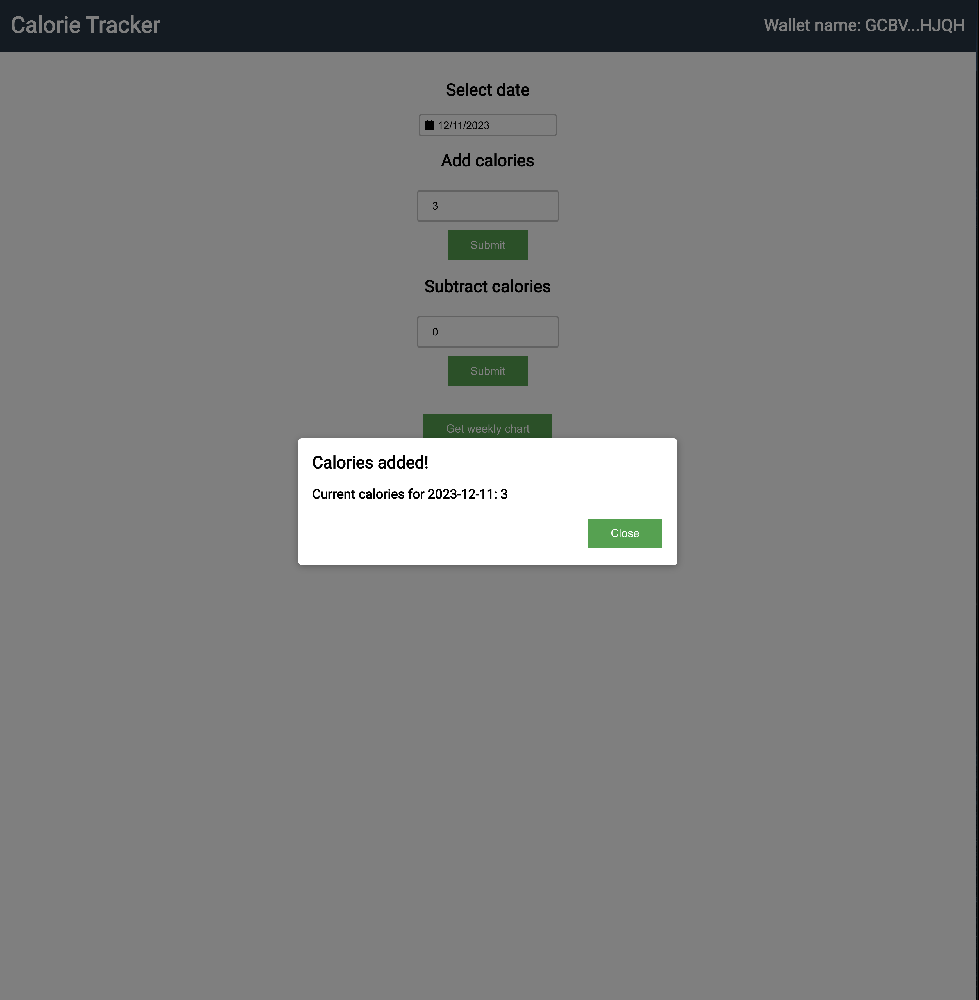

# calorie-tracker

calorie-tracker is a decentralized application built on Soroban and React. It allows users to
track their calories for each day. It provides three contract functions:

* `add`: To add calories for a particular date
* `subtract`: To subtract calories for a particular date
* `get`: To get the total calorie count for a range of dates

The DAPP lets you add or subtract calories for a date and provides you a weekly chart to make it easy for you to track calories.





## Getting Started

### Install Dependencies

* rustc >= 1.71.0 with the wasm32-unknown-unknown target installed. See https://soroban.stellar.org/docs/getting-started/setup#install-rust.
  If you have already a lower version, the easiest way to upgrade is to uninstall (rustup self uninstall) and install it again.
* soroban-cli. See https://soroban.stellar.org/docs/getting-started/setup#install-the-soroban-cli but instead of `cargo install soroban-cli`,
  run `cargo install_soroban`. This is an alias set up in `.cargo/config.toml`, which pins the local soroban-cli to a specific version.
  If you add `./bin` to your `$PATH`, then you'll automatically use this version of soroban-cli when you're in this directory.
* Node.js v18
* [Freighter Wallet](https://www.freighter.app/) ≥[v5.0.2](https://github.com/stellar/freighter/releases/tag/2.9.1).
  Or from the Firefox / Chrome extension store. Once installed, enable "Experimental Mode" in the settings (gear icon).

### Contract

To make it easy to interact with Soroban, the project includes a Makefile that has targets for some frequent commands
you might need to use. You can learn the exact Soroban CLI commands by going to the respective Make target.

To build the contract and compile it to a WASM file, run:
```bash
make build
```

Before we can deploy, we need to configure a network to deploy the contract on and create an identity to associate it with:
```bash
make network
make identity
make fund
```

Now we can deploy this WASM file onto the Stellar network:
```bash
make deploy
```
The contract ID must be now present in the `.soroban/calorie-tracker-id`. You can confirm this by running:
```bash
cat ./soroban/calorie-tracker-id
```

Now invoke the contract:
```
SOURCE=<source> ADDRESS=<address> CALORIES=<calroies> DATE=<date> make add
SOURCE=<source> ADDRESS=<address> CALORIES=<calroies> DATE=<date> make subtract
```

### Frontend

To run the frontend, simply run:
```
npm install
npm run start
```

This will install all dependencies, generate the Typscript contract bindings and start the React server.
Now go to `localhost:3000` and have some fun!
